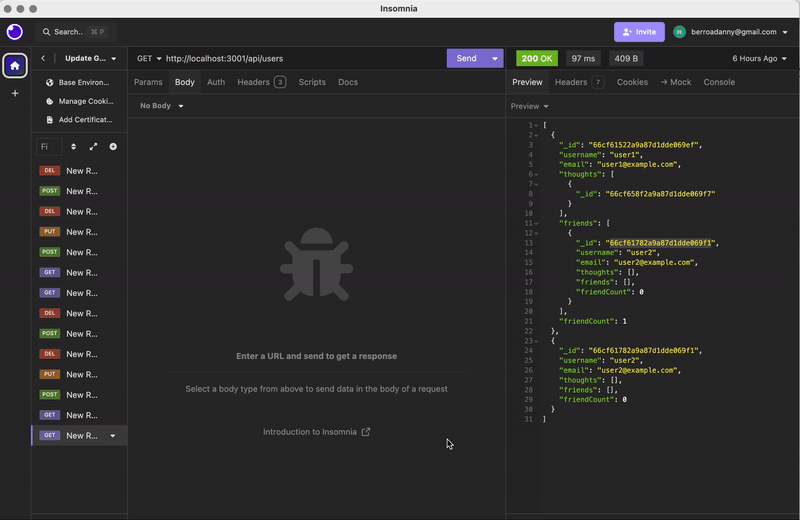
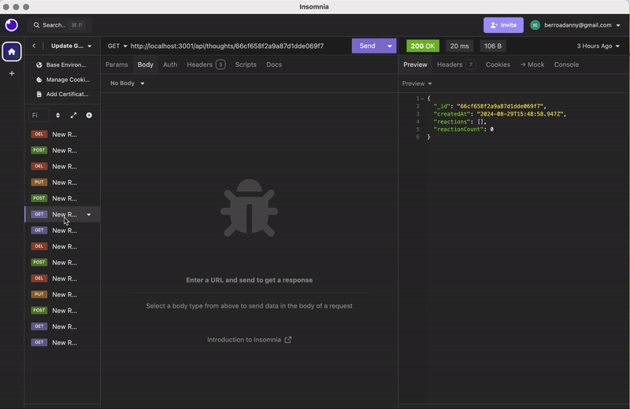

# Social Network API

## Description

This is a RESTful API for a social network web application where users can share their thoughts, react to friends' thoughts, and create a friend list. It uses Express.js for routing, a MongoDB database, and the Mongoose ODM.

## Table of Contents

- [Installation](#installation)
- [Usage](#usage)
- [API Routes](#api-routes)
- [Demo](#demo)
- [Questions](#questions)

## Installation

1. Clone the repository
2. Install dependencies with `npm install`
3. Ensure MongoDB is installed and running on your machine
4. Start the server with `npm start`

## Usage

Use an API client like [Insomnia](https://insomnia.rest/) or [Postman](https://www.postman.com/) to test the API routes.

## API Routes

### Users

- GET /api/users - get all users
- GET /api/users/:id - get a single user by id
- POST /api/users - create a new user
- PUT /api/users/:id - update a user by id
- DELETE /api/users/:id - delete a user

### Friends

- POST /api/users/:userId/friends/:friendId - add a friend
- DELETE /api/users/:userId/friends/:friendId - remove a friend

### Thoughts

- GET /api/thoughts - get all thoughts
- GET /api/thoughts/:id - get a single thought by id
- POST /api/thoughts - create a new thought
- PUT /api/thoughts/:id - update a thought by id
- DELETE /api/thoughts/:id - delete a thought

### Reactions

- POST /api/thoughts/:thoughtId/reactions - create a reaction
- DELETE /api/thoughts/:thoughtId/reactions/:reactionId - delete a reaction

## Demo

The demo above shows the following operations:

1. GET all users
2. GET a single user by ID
3. POST a new user
4. PUT to update a user
5. DELETE a user
6. POST to add a friend to a user's friend list
7. DELETE to remove a friend from a user's friend list
8. GET all thoughts
9. GET a single thought by ID
10. POST a new thought
11. PUT to update a thought
12. DELETE a thought
13. POST to create a reaction stored in a single thought's reactions array field
14. DELETE to pull and remove a reaction by the reaction's reactionId value

## Questions

For any questions about the repo, please contact me directly at [berroadanny@gmail.com](mailto:berroadanny@gmail.com)
You can find more of my work on GitHub at [Daniel639](https://github.com/daniel639)